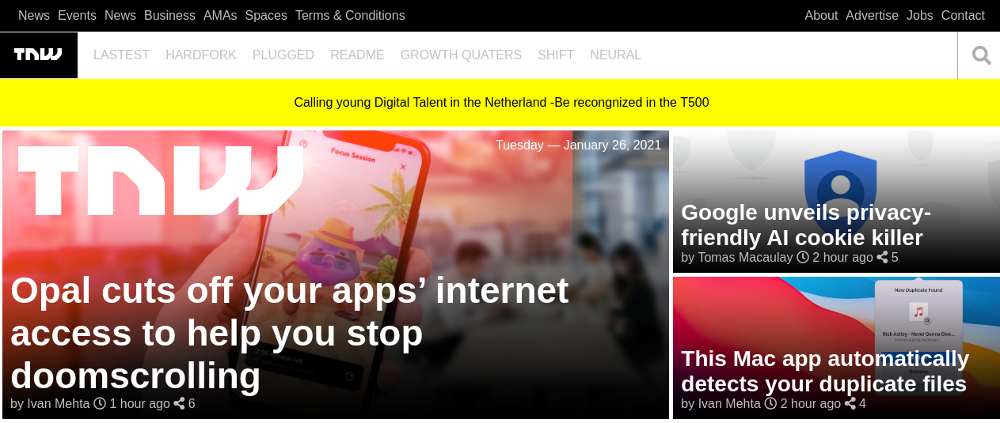

# MV-Week2-ResponsiveSite

> This is the second project for Microverse.



This is the first project for Microverse, a fully responsive page based on this site:

https://perma.cc/M5ZV-Q2D6

In this exercise, responsive design techniques are applied in order for the website to change the content disposal according to the size of the screen where the website is displayed.

A mobile-first approach is used: The page is designed for the mobile version first and then the mediaqueries are created for the tablet and desktop versions.

## Built With

- HTML
- CSS

## Live Demo

[Live Demo Link](https://carlos-osorio-developer.github.io/mv-week2-responsive/)


## Getting Started

To get a local copy up and running follow these simple example steps.

### Prerequisites

git

### Setup

Open your terminal and locate on the folder you want to clone the repository.

### Install

Run the following command into your terminal: 

```console
git clone https://github.com/carlos-osorio-developer/mv-week2-responsive
```

### Usage

Run index.html in your preferred browser.

## Authors

👤 **Carlos Osorio**

- GitHub: [@carlos-osorio-developer ](https://github.com/carlos-osorio-developer)
- Twitter: [@OsorioDevelops](hhttps://twitter.com/OsorioDevelops)
- LinkedIn: [Carlos Osorio](https://www.linkedin.com/in/carlos-osorio-developer/)

👤 **Eri-Ngozi Okereafor**

- GitHub: [@](https://github.com/)
- Twitter: [@](hhttps://twitter.com/)
- LinkedIn: [](https://www.linkedin.com/in/)

## 🤝 Contributing

Contributions, issues, and feature requests are welcome!

Feel free to check the [issues page](./issues/).

## Show your support

Give a ⭐️ if you like this project!

## Acknowledgments

- Thanks to Microverse and his supportive community.
- Thanks to everyone commiting in this project.

## 📝 License

This project is [MIT](lic.url) licensed.
